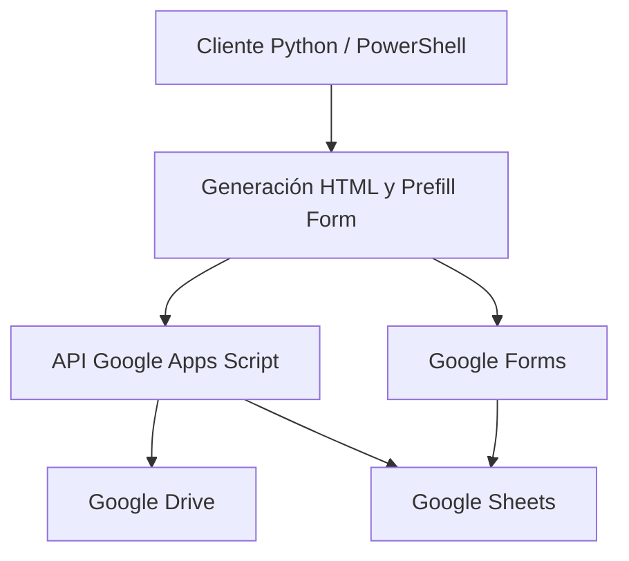

# Hoja de Vida de Equipos PC

[](https://www.python.org/)
[](https://developers.google.com/apps-script)
[](https://developers.google.com/drive)
[](https://learn.microsoft.com/powershell/)
[](LICENSE)
[](#verificacion-local)

## Descripción y valor de negocio

Hoja de Vida de Equipos PC es una solución de inventario técnico para equipos
Windows. Automatiza el levantamiento de hardware, sistema operativo, red,
almacenamiento, memoria y GPU; genera un informe HTML; lo publica en Google
Drive; registra la trazabilidad técnica en Google Sheets y abre un Google Form
prellenado para completar los datos humanos del responsable.

El sistema reduce errores de digitación y omisiones del levantamiento manual,
estandariza la identificación de activos y separa la información técnica de la
información administrativa. Esta separación facilita auditoría, soporte,
inventario y gestión de activos de TI en campo.

## Arquitectura



El cliente Python ejecuta consultas PowerShell locales. Apps Script funciona
como backend de integración para Drive y Sheets. Google Forms captura los datos
humanos, mientras la hoja técnica recibe directamente el inventario generado.

## Características principales

- Identificador técnico único con formato
   `HV-YYYYMMDD-HHMMSS-XXXXXX`.
- Recolección de BIOS, CPU, RAM, discos, particiones, red, GPU y sistema
   operativo mediante PowerShell/CIM.
- Generación de informes HTML con datos escapados para reducir riesgos de
   inyección HTML/XSS.
- Integración con Google Drive mediante un Web App de Apps Script.
- Registro técnico centralizado en la hoja `TECNICA_EQUIPOS`.
- Control de concurrencia en Apps Script mediante `LockService` para evitar
   conflictos durante guardados y depuración de duplicados.
- Detección y gestión de envíos duplicados mediante `ID_EQUIPO`.
- Ejecución no interactiva de las consultas PowerShell, adecuada para
   automatización o programación en Windows; al completar el flujo se abre el
   formulario para la captura humana.
- Separación segura de datos: información humana en Google Forms e inventario
   técnico en Google Sheets.
- Cliente modular, logging estándar, pruebas unitarias y empaquetado como EXE.

## Estructura del proyecto

```text
.
├── hv_pc_form_launcher.py       # Punto de entrada compatible
├── hv_pc_launcher/               # Paquete modular del cliente Python
│   ├── __init__.py
│   ├── config.py                 # Carga, validación y URL de prellenado
│   ├── collector.py              # PowerShell e inventario del equipo
│   ├── reporter.py               # Resúmenes y generación del HTML
│   ├── api_client.py             # Integración HTTP con Apps Script
│   └── main.py                   # Orquestación y logging
├── tests/
│   └── test_launcher.py          # Pruebas unittest de funciones puras
├── apps_script/
│   ├── Code.gs                   # Upload, render y registro en Sheets
│   └── README_apps_script.md     # Despliegue y propiedades del Web App
├── config.example.json           # Plantilla sin datos operativos
├── config.json                   # Configuración local, no publicable
├── requirements.txt              # Dependencias Python
├── LICENSE                       # Licencia MIT
├── CHANGELOG.md                  # Historial de versiones
└── README_python_flujo.md        # Descripción detallada del flujo
```

Los directorios `.venv/`, `build/`, `dist/`, cachés y configuraciones locales
están excluidos por `.gitignore`. El ejecutable de distribución se genera en
`dist/` y no debe incluir credenciales.

## Requisitos

- Windows 10/11 con PowerShell disponible.
- Python 3.10 o superior.
- Cuenta Google con acceso a Forms, Sheets y Drive.
- Web App de Google Apps Script desplegada como `/exec`.
- Entorno virtual `.venv` válido.

## Instalación y configuración

Desde PowerShell, en la raíz del proyecto:

```powershell
py -3 -m venv .venv
.venv\Scripts\Activate.ps1
python -m pip install --upgrade pip
python -m pip install -r requirements.txt
```

Si `.venv` ya existe y es válido, no es necesario crearlo nuevamente. En ese
caso basta con activarlo y actualizar sus dependencias:

```powershell
.venv\Scripts\Activate.ps1
python -m pip install -r requirements.txt
```

Cree la configuración local a partir de la plantilla:

```powershell
Copy-Item config.example.json config.json
```

Complete `config.json` con:

- `form_view_url`: URL pública del Google Form.
- `spreadsheet_url`: URL de la hoja principal.
- `output_dir`: carpeta local para los informes HTML.
- `apps_script.web_app_url`: URL `/exec` del Web App.
- `apps_script.token`: valor de `APP_TOKEN` configurado en Apps Script.
- `apps_script.folder_id`: carpeta destino de Google Drive.
- `apps_script.spreadsheet_id`: hoja de destino técnico.
- `apps_script.technical_sheet_name`: normalmente `TECNICA_EQUIPOS`.
- `entry_ids`: identificadores `entry.*` del formulario.

En Apps Script configure también `APP_TOKEN`, `DRIVE_FOLDER_ID`,
`SPREADSHEET_ID`, `TECHNICAL_SHEET_NAME`, `FORM_RESPONSES_SHEET` e
`INCIDENCIAS_SHEET_NAME` en las propiedades del proyecto. Ejecute
`setupTriggers()` una sola vez para instalar el trigger de formulario.

## Ejecución

```powershell
.venv\Scripts\python.exe hv_pc_form_launcher.py
```

El cliente recolecta la información local, genera el HTML, intenta subirlo a
Drive, guarda el registro técnico y abre el formulario prellenado.

## Pruebas unitarias

La suite usa únicamente `unittest` de la biblioteca estándar:

```powershell
.venv\Scripts\python.exe -m unittest discover -s tests -p "test_*.py" -v
```

Las pruebas cubren el formato del identificador, los resúmenes de red y RAM y
la construcción de URLs prellenadas. No ejecutan consultas PowerShell ni
realizan peticiones contra servicios de Google.

## Compilación a ejecutable

Comando exacto desde la raíz del proyecto:

```powershell
.venv\Scripts\python.exe -m PyInstaller --onefile --noconfirm --clean --name hv_pc_form_launcher --paths . --collect-submodules hv_pc_launcher --distpath dist --workpath build --specpath build hv_pc_form_launcher.py
```

La salida esperada es:

```text
dist\hv_pc_form_launcher.exe
```

Para distribuirlo, mantenga `config.json` junto al ejecutable. No publique el
archivo de configuración ni empaquete tokens reales en el repositorio.

## Seguridad y buenas prácticas

- Mantenga `config.json` y `dist/config.json` fuera del control de versiones.
- Nunca publique `APP_TOKEN`, IDs privados ni URLs operativas con credenciales.
- Rote `APP_TOKEN` en Apps Script y en `config.json` si existe una exposición.
- Revise el historial Git si un secreto estuvo versionado anteriormente.
- Valide que los informes de Drive no queden accesibles públicamente si
   contienen seriales, MAC, usuarios, dominios o información de red sensible.
- El HTML generado escapa valores antes de renderizarlos.
- Las operaciones críticas de Apps Script utilizan `LockService`.
- Use permisos mínimos en Google Drive, Sheets y Apps Script.

## Verificación local

La validación recomendada antes de publicar es:

```powershell
.venv\Scripts\python.exe -m unittest discover -s tests -p "test_*.py" -v
.venv\Scripts\python.exe -W error -m compileall -q hv_pc_launcher tests hv_pc_form_launcher.py
git diff --check
```

## Licencia y autoría

Este proyecto se distribuye bajo la [Licencia MIT](LICENSE).

Copyright (c) 2026 Euler Arturo Chapid Inagan.
# Hoja de Vida de Equipos PC

Automatiza el registro de activos de TI en campo:

- Recolecta informacion tecnica del equipo (hardware, red, almacenamiento, RAM, GPU, SO).
- Genera hoja de vida en HTML.
- Sube el HTML a Google Drive.
- Abre Google Forms prellenado con datos tecnicos.
- Guarda la trazabilidad en Google Sheets.

## Caracteristicas

- ID unico por registro (`HV-YYYYMMDD-HHMMSS-XXXXXX`).
- Integracion con Google Forms (prefill por `entry.*`).
- Integracion con Apps Script Web App para subida a Drive.
- Enlace renderizado del HTML desde Apps Script (`doGet?fileId=...`).
- Salida lista para soporte e inventario.

## Estructura

- `hv_pc_form_launcher.py`: Punto de entrada compatible.
- `hv_pc_launcher/`: Paquete modular del cliente Python.
   - `config.py`: Carga y validacion de configuracion.
   - `collector.py`: Recoleccion mediante PowerShell.
   - `reporter.py`: Generacion del informe HTML.
   - `api_client.py`: Integracion HTTP con Apps Script.
   - `main.py`: Orquestacion y logging.
- `tests/test_launcher.py`: Pruebas unitarias de las funciones puras.
- `config.example.json`: Plantilla de configuracion.
- `config.json`: Configuracion local de ejecucion.
- `apps_script/Code.gs`: Backend Apps Script (upload + render).
- `apps_script/README_apps_script.md`: Despliegue Apps Script.
- `README_python_flujo.md`: Flujo tecnico detallado.
- `dist/hv_pc_form_launcher.exe`: Ejecutable de produccion.

## Requisitos

- Windows con PowerShell.
- Python 3.10+ (si ejecutas script fuente).
- Dependencia `requests` instalada desde `requirements.txt`.
- Cuenta Google con acceso a Forms/Sheets/Drive.
- Apps Script Web App desplegada.

## Configuracion Rapida

1. Copia `config.example.json` a `config.json`.
2. Llena:
   - URL del Form (`form_view_url`).
   - `entry_ids` del Form.
   - Apps Script (`web_app_url`, `token`, `folder_id`).
3. Prueba local:

```powershell
python hv_pc_form_launcher.py
```

La ejecucion requiere `requests`, definido en `requirements.txt`.

## Pruebas Unitarias

Desde la raiz del proyecto, instalar las dependencias en el entorno virtual:

```powershell
.venv\Scripts\python.exe -m pip install -r requirements.txt
```

Ejecutar toda la suite con `unittest`:

```powershell
.venv\Scripts\python.exe -m unittest discover -s tests -p "test_*.py" -v
```

Las pruebas no ejecutan PowerShell ni realizan peticiones a Google. Validan
el formato del ID, los resumenes de red y RAM, y la URL prellenada del formulario.

## Ejecucion en Produccion

Desde el paquete generado:

1. Mantener juntos en la misma carpeta:
   - `hv_pc_form_launcher.exe`
   - `config.json`
2. Ejecutar `hv_pc_form_launcher.exe`.

## Compilacion EXE

```powershell
.venv\Scripts\python.exe -m PyInstaller --onefile --noconfirm --clean --name hv_pc_form_launcher --paths . --collect-submodules hv_pc_launcher --distpath dist --workpath build --specpath build hv_pc_form_launcher.py
```

El ejecutable se genera como `dist\hv_pc_form_launcher.exe`. Para ejecutarlo
en produccion se debe mantener `config.json` junto al ejecutable.

## Seguridad

- No compartas `APP_TOKEN` fuera del equipo de sistemas.
- Evita publicar `config.json` con credenciales reales.
- Si un token se expone, rotalo en Apps Script y actualiza `config.json`.

## Estado

Version estable para uso operativo interno.
